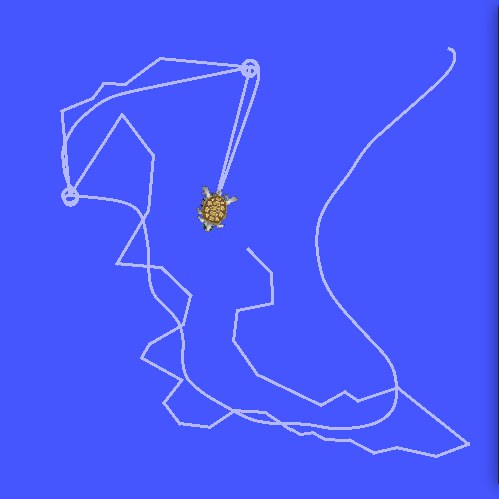
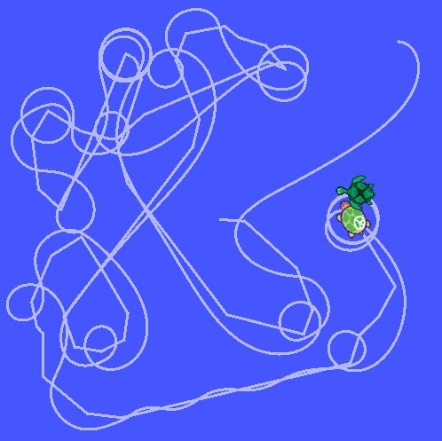

# TURTLES "CATCH-UP"

This project is "Catch-UP" game between 2 turtles written in python for ROS environment as part of the assignment NSTU feat. ETU study program.

## Environment info (prerequisites)

Ubuntu: **20.04**

ROS: **Noetic 1.16.0**

Python: **3.8**

## Quick-start

First-time make:

```bash
catkin_make
```

Build:

```
source devel/setup.bash
roslaunch turtles_catch_up turtles_catch_up.launch
```

Start app:

```bash
rosrun rqt_graph rqt_graph
```

## UI-Examples





